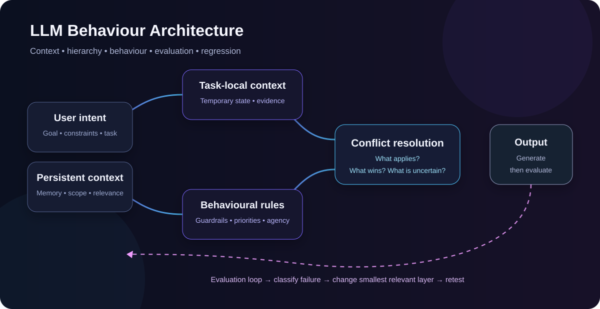
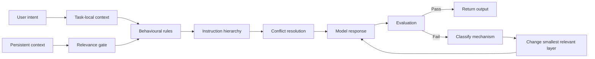

<div align="center">

# LLM Behaviour Architecture

### Designing conversational AI that remains coherent when context gets messy

**Context Engineering · Behavioural Evaluation · Failure Analysis · Human-AI Interaction**


</div>

<p align="center">
  
</p>

---

## The problem

A conversational model can produce a fluent, locally plausible answer and still fail the actual system objective.

The failure may sit somewhere else entirely:

- the wrong context was retrieved
- persistent information leaked outside its scope
- two instructions competed without a clear priority
- behaviour drifted as the conversation grew
- the model inferred continuity it did not actually possess
- the response followed the literal request while missing the user's practical objective

This project treats those failures as **system behaviour**, not as isolated bad prompts.

## What this case study demonstrates

| Capability | What is being tested |
|---|---|
| **Context engineering** | What the model should know, when it should use it, and when it should ignore it |
| **Instruction hierarchy** | Which requirement wins when instructions compete |
| **Behavioural evaluation** | Whether higher-level behaviour remains stable across varied outputs |
| **Failure analysis** | Classification by mechanism rather than surface wording |
| **Long-context testing** | Drift, contamination, stale state, and changing priorities |
| **Regression testing** | Whether a local fix damages unrelated desired behaviour |
| **Human-AI interaction** | Relevance, uncertainty, user agency, and useful intervention boundaries |

## Architecture



The architecture separates **what the system knows** from **how the system should behave**.

That separation matters because adding more information does not automatically improve reliability. In long-context systems, additional state can create new failure modes unless relevance, scope, and priority are explicit.

→ [Read the architecture](architecture.md)

## Failure catalogue

The repository tracks recurring mechanisms such as:

`instruction drift` · `context contamination` · `priority inversion` · `scope leakage` · `persona instability` · `false continuity` · `overconfident inference` · `unnecessary clarification` · `literal compliance / practical failure` · `regression after local fixes`

→ [Explore the failure modes](failure-modes.md)

## Evaluation model

Outputs are evaluated against behaviour rather than wording alone.

**Core dimensions**

- relevance
- instruction adherence
- intent alignment
- behavioural consistency
- context stability
- uncertainty handling
- user agency
- regression resistance

A response does not pass merely because it sounds good. It passes when the system behaves correctly under the conditions being tested.

→ [See the evaluation framework](evaluation-framework.md)

## Example evaluation pattern

> **Observed failure**  
> A persistent preference is applied to an unrelated technical task.
>
> **Diagnosis**  
> The preference exists in persistent context without a relevance boundary.
>
> **Intervention**  
> Add domain-specific relevance gating rather than deleting the preference.
>
> **Retest**  
> The preference is ignored for the technical task.
>
> **Regression check**  
> It still activates correctly in the domain where it belongs.

The full set of reconstructed, privacy-safe examples follows the same pattern:

**Observed behaviour → likely mechanism → intervention → retest → regression check**

→ [View sanitised test cases](examples/sanitised-test-cases.md)

## Method

1. Define intended behaviour in observable terms.
2. Separate persistent context from task-local state.
3. Make instruction priority explicit.
4. Test baseline, ambiguity, conflict, long-context, relevance, and adversarial cases.
5. Classify failure by mechanism.
6. Change the smallest relevant part of the architecture.
7. Retest the original failure.
8. Run regression cases.
9. Record the decision and why it changed.

## Why the repository is text-first

The technical artefact here is the **behavioural architecture and evaluation logic**.

Code would not make a taxonomy, decision rule, or evaluation criterion more valid simply by making the repository look more technical. A production implementation could later wrap these artefacts in automated test runners, datasets, model/version metadata, observability, scoring, and review queues.

→ [Read the design decisions](design-decisions.md)

## Repository map

```text
llm-behaviour-architecture/
├── README.md
├── architecture.md
├── failure-modes.md
├── evaluation-framework.md
├── design-decisions.md
├── COPYRIGHT.md
└── examples/
    └── sanitised-test-cases.md
```

## Scope and privacy

This is a public, sanitised portfolio case study derived from independent applied-AI work.

Original private conversations, personal information, and source material are not published. Examples are reconstructed to make the methodology inspectable without exposing private data.

## Author

**Andreea Sackman**  
Applied AI Systems & Product Operations  
LLM Behaviour · Evaluation · Prompt & Context Engineering · Conversational AI

---

© 2026 Andreea Sackman. All rights reserved.

This repository is published as a portfolio case study. No open-source licence is granted. See [COPYRIGHT.md](COPYRIGHT.md).
