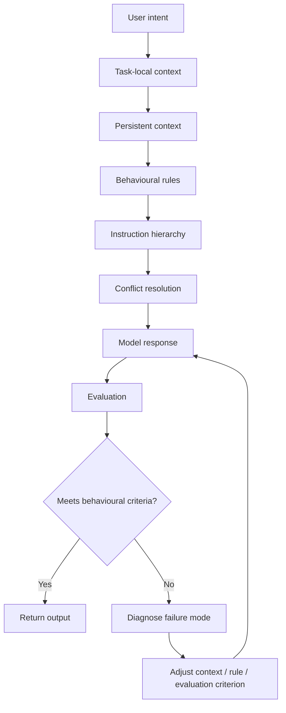

# LLM Behaviour Architecture

A practical case study in designing, testing, and refining persistent conversational behaviour in long-context LLM systems.

This repository documents a systems approach to conversational AI: how instructions, context, state, memory, user intent, behavioural constraints, and evaluation interact over time.

The focus is not on isolated prompt performance. It is on behaviour that has to remain useful and coherent across changing context, ambiguous requests, conflicting priorities, and real users.

## What this project demonstrates

- Prompt and context engineering
- Instruction hierarchy and conflict handling
- Persistent versus task-local context
- Behavioural evaluation across long interactions
- Failure-mode analysis
- Edge-case and adversarial testing
- Human-in-the-loop safeguards
- User-agency preservation
- Iterative evaluation and regression testing

## Core problem

A model can produce a locally plausible response while still failing the actual system objective.

Common causes include:

- relevant context being ignored
- irrelevant persistent context being over-applied
- conflicting instructions competing without clear priority
- behavioural rules drifting over long interactions
- false continuity or unsupported inference
- literal compliance that misses user intent
- uncertainty being hidden behind fluent language

The design goal is therefore not simply "better prompts". It is a context and behaviour architecture that makes intended behaviour more stable, inspectable, and testable.

## Architecture

See [architecture.md](architecture.md) for the design logic.

## Evaluation loop

The system is assessed against behaviour rather than style alone.

| Dimension | Example question |
|---|---|
| Relevance | Did the system use only context that materially applies? |
| Instruction adherence | Did it follow the correct instruction when rules conflicted? |
| User intent | Did it solve the user's actual task rather than only the literal wording? |
| Context stability | Did behaviour remain coherent as context accumulated? |
| Uncertainty | Did it distinguish known facts, inference, and missing information? |
| User agency | Did it inform and assist without taking over decisions unnecessarily? |
| Regression resistance | Did a fix introduce a new failure elsewhere? |

See [evaluation-framework.md](evaluation-framework.md).

## Failure analysis

The project tracks recurring failure classes instead of treating each bad answer as an isolated event.

Examples include:

- instruction drift
- context contamination
- priority inversion
- scope leakage
- persona instability
- false continuity
- overconfident inference
- unnecessary clarification
- over-application of persistent preferences
- technically compliant but practically wrong responses

See [failure-modes.md](failure-modes.md).

## Sanitised examples

The repository includes compact, privacy-safe examples showing:

**Observed behaviour → likely cause → intervention → retest**

See [examples/sanitised-test-cases.md](examples/sanitised-test-cases.md).

## Method

1. Define the intended behaviour.
2. Identify which information belongs in persistent context versus task-local context.
3. Make instruction priority explicit.
4. Test normal, ambiguous, adversarial, and long-context cases.
5. Classify failures by mechanism rather than wording.
6. Change the smallest relevant part of the architecture.
7. Retest the original case.
8. Run regression cases to detect collateral failures.
9. Record what changed and why.

## Scope

This is a public, sanitised case study derived from independent applied-AI work. Private or personal source material is excluded. Examples are reconstructed to demonstrate the method without exposing confidential or personal data.

## Author

**Andreea Sackman**  
Applied AI Systems & Product Operations  
LLM Behaviour · Evaluation · Prompt & Context Engineering · Conversational AI

## Copyright

© 2026 Andreea Sackman. All rights reserved.

This repository is published as a portfolio case study. Reuse, redistribution, adaptation, or commercial use requires permission. No open-source licence is granted.
